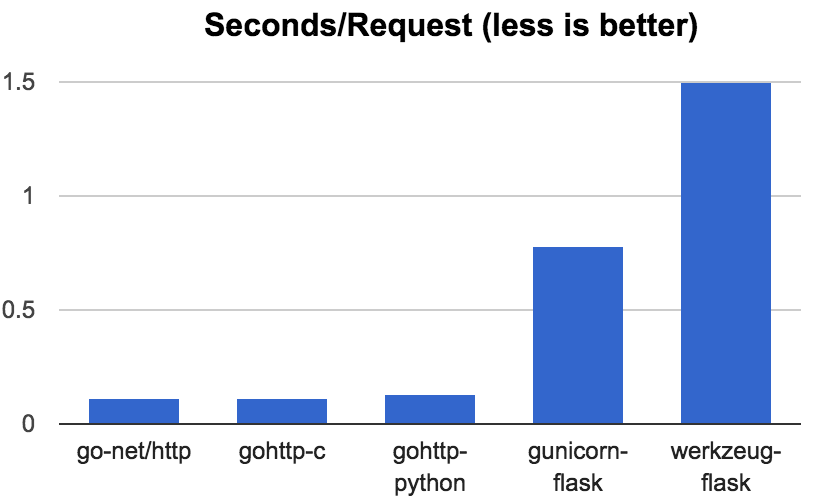

# See Python, See Python Go, Go Python Go

Versions:
* Go 1.6
* Python 3.5


## Running a webserver in Go

```go
package main

import (
    "fmt"
    "net/http"
)

func index(w http.ResponseWriter, req *http.Request) {
    fmt.Fprintf(w, "Hello, world.\n")
}

func main() {
    http.HandleFunc("/", index)
    http.ListenAndServe("127.0.0.1:5000", nil)
}
```

## Running a webserver in Python

```python
from flask import Flask
app = Flask(__name__)

@app.route('/')
def index():
    return 'Hello, world!\n'

if __name__ == '__main__':
    app.run(host='127.0.0.1', port=5000)
```

## Running a Go webserver in Python??

```python
from gohttp import route, run

@route('/')
def index(w, req):
    w.write("Hello, world.\n")

if __name__ == '__main__':
    run(host='127.0.0.1', port=5000)
```

## Yo--whaa???

That's right.

Want to give it a try *right now?* Hit this shiny button:

[](https://heroku.com/deploy?template=https://github.com/shazow/gohttplib-heroku)


## How?

At first, Go was created to be run as a single statically linked binary
process. Later, more *execution modes* were added to let us compile Go as
dynamically linked binaries. In Go 1.5, additional modes were added to allow us
to build Go code into shared library that is runnable from other
runtimes.

Just like how all kinds of Python modules like lxml use C to run
super-optimized code, you can now run Go code just the same. More or less.


## Considerations

### Runtime Overhead

When a Go library is used from another runtime, it spins up the Go runtime in
parallel with the caller's runtime (if any). That is, it gets the goroutine
threads and the garbage collector and all that other nice stuff you'd normally
boot up when calling Go on its own.

This is different than calling vanilla C code because technically there is no
innate C runtime involved. There is no default worker pools, no default garbage
collector. You might call a C library which has its own equivalents of this,
then all bets are off, but in most simple cases you get very little overhead
from calling C. This is something to consider when calling out to code that
requires its own runtime to co-exist.


### Runtime Boundaries

Moving memory (or objects) between runtime can be tricky and dangerous,
especially when garbage collectors are involved. Both Go and Python have their
own garbage collector. If you share the same memory pointer between the two
runtimes, one garbage collector might decide that it's no longer used and clear
the memory while the other runtime would be all "WHY'D YOU DO THAT??" and
crash. Or worse, it could try to move it around, or change the memory's layout
in a way that the runtimes disagree, then we'd get weird hard-to-diagnose
heisenbugs.

The safest thing to do is to copy data across boundaries when possible, or
treat it as immutable read-only data when it's too big to be copied.


### Runtime Demilitarized Zone

When mediating calls between two runtimes like Go and Python, we use C land in
between them as a kind of demilitarized zone because C has no runtime and we
can trust it to not mess with our data all willynilly.


## The Plan

In this proof-of-concept, we're going to use the Go webserver, but we want to
provide a Python handler that will get called when our route gets hit.

1. Make a Go webserver, easy peasy.

2. Make it into a module that is exported into a C shared library.

3. Add a handler registry bridge in C.

4. Add some helpers for calling Go interface functions from C.

5. Add headers for importing the shared library in Python.

6. Write our handler to use the C registry bridge in Python, and the helpers to
   interact with the data to create a response.


[[XXX: DIAGRAM]]


## World of Go

Let's explore how to call C from Go and Go from C.

### Calling C from Go

Calling C from Go is about as easy at it gets. In fact, we can embed C code in a 
comment right above an `import "C"` and the Go compiler will handle building and 
linking it for us.

```go
package main

/*
int the_answer() {
	return 42;
}
*/
import "C"
import "fmt"

func main() {
	r := C.the_answer()
	fmt.Println(r)
}
```

We use the magic `C.*` namespace to access anything from the world of C, even
if it's not inlined directly above it. We can `#include` things as we normally
would, too.

Additional reading material:

* https://blog.golang.org/c-go-cgo
* https://golang.org/cmd/cgo/
* https://github.com/golang/go/wiki/cgo


### Calling Go from C

To call Go from C, we'll need to compile our Go
as a shared object and import it. To identify the which Go API we want to
expose in C land, we export it explicitly with an `//export ...` comment 
directive.

```go
package main

import "C"

//export TheAnswer
func TheAnswer() C.int {
	return C.int(42)
}

func main() {}
```

Three things about this code snippet:

1. We need to make sure that the interface for the exported function is properly 
   laden with C types. That means inputs and outputs all need to be C types, and 
   our Go code will cast in and out of them as needed.

2. Our shared object needs to be `package main` and have an empty `main()` 
   function. Part of the process for CGO building into a shared library is 
   creating an injection point for spawning the Go runtime.

3. There are many nuances regarding passing memory beyond the Go boundary which 
   are not expressed in this basic example, more on that in the links at the end 
   of the section.

```
$ go build -buildmode=c-shared -o libanswer.so
```

This will create a `libanswer.so` shared object and a corresponding 
`libanswer.h` header file that we can reference from our C code.

Now we'll make our C code in a different directory and bring in the 
`libanswer.so` and `libanswer.h` files there.

```c
#include <stdio.h>
#include "libanswer.h"

int main() {
    int r = TheAnswer();
    printf("%d\n", r);
    return 0;
}
```

```
$ gcc -o answer main.c -L. -lanswer
$ ./answer
42
```

Success, we called Go code from C.

More specific reading in the aforementioned links:

* https://golang.org/cmd/cgo/#hdr-C_references_to_Go
* https://golang.org/cmd/cgo/#hdr-Passing_pointers


## World of Python

Now onto the Python side of this business. Same idea, let's look at how to call 
Python from C and C from Python.

### Calling C from Python

There are two approaches to calling C from Python.

One method is using [the C Stable 
ABI](https://docs.python.org/3/c-api/index.html) which lets us dive in with no 
additional dependencies. This works by explicitly defining all of the necessary 
headers and stubs that Python needs to figure out how to call the C code.

The other method is using [CFFI](https://docs.python.org/3/c-api/index.html), 
which automatically generates all of the headers and stubs for us. We'll explore 
the CFFI method for the sake of convenience.

```python
# answer_build.py:
from cffi import FFI
ffi = FFI()

ffi.cdef("int the_answer();")

ffi.set_source("_answer",
"""
    int the_answer() {
        return 42;
    }
""")

if __name__ == "__main__":
    ffi.compile()
```

Calling the CFFI file will generate the necessary boilerplate for calling this 
corresponding C code from Python.

```
$ python answer_build.py
$ ls
_answer.c       _answer.o       _answer.so      answer_build.py
```

Now to call it from Python, we'll need two more files: `answer.py` and 
`__init__.py` (because Python).

```python
# answer.py:
from _answer import lib

r = lib.the_answer()
print(r)
```

Here we go:

```
$ python answer.py
42
```

Success, we called C from Python!

This was cheating a bit, same way we cheated in the Go version because the C was 
embedded inside of Python code. But, it's not that far from a real world 
scenario: We could just as easily `#include` our way into all kinds of external 
C logic, even if that part is embedded.

There are other ways of doing this too, [have a look at the CFFI 
documentation](http://cffi.readthedocs.io/en/latest/overview.html), but this 
will do for now.


### Calling Python from C

Calling Python from C is, of course, also possible. We won't actually need it 
for our goal here today, so figuring it out is left as an exercise for the 
reader.

See also: http://cffi.readthedocs.io/en/latest/embedding.html


## Putting it together: gohttplib

*Alternate title: The Go, The Bad, and the Ugly*

The full source code with Python and C examples of gohttplib is available on 
Github: https://github.com/shazow/gohttplib

We're going to fly through the important bits really fast to get the idea of how 
it works and how to run it on Heroku.


### The Go and C

```go
package main

/*
typedef struct Request_
{
    const char *Method;
    const char *Host;
    const char *URL;
} Request;

typedef unsigned int ResponseWriterPtr;

typedef void FuncPtr(ResponseWriterPtr w, Request *r);

extern void Call_HandleFunc(ResponseWriterPtr w, Request *r, FuncPtr *fn);
*/
import "C"
import (
	"net/http"
	"unsafe"
)

var cpointers = PtrProxy()

//export ListenAndServe
func ListenAndServe(caddr *C.char) {
	addr := C.GoString(caddr)
	http.ListenAndServe(addr, nil)
}

//export HandleFunc
func HandleFunc(cpattern *C.char, cfn *C.FuncPtr) {
	pattern := C.GoString(cpattern)
	http.HandleFunc(pattern, func(w http.ResponseWriter, req *http.Request) {
		// Wrap relevant request fields in a C-friendly datastructure.
		creq := C.Request{
			Method: C.CString(req.Method),
			Host:   C.CString(req.Host),
			URL:    C.CString(req.URL.String()),
		}
		// Convert the ResponseWriter interface instance to an opaque C integer
		// that we can safely pass along.
		wPtr := cpointers.Ref(unsafe.Pointer(&w))
		// Call our C function pointer using our C shim.
		C.Call_HandleFunc(C.ResponseWriterPtr(wPtr), &creq, cfn)
		// Release the ResponseWriter from the registry since we're done with
		// this response.
		cpointers.Free(wPtr)
	})
}

func main() {}
```

Let's break it down.

We're exporting two functions into the C API:

* `ListenAndServe` which is used to start our server.
* `HandleFunc` which is used to register a callback handler for some route 
    pattern.

Note that the exported functions all take in `C.*` types, because they'll be 
called from the C side of things.

There is a tricky bit here, though: The `HandleFunc` callback function pointer 
accepts two parameters: `http.ResponseWriter` and `*http.Request`. This isn't 
going to fly for two reasons: The first one is a Go *interface* and C has no 
idea what an interface is (let alone Python) and the second one is a pointer to 
an instance which we can't share across the runtime boundary because that's a 
big no-no (see the *Considerations* section).

For the `*http.Request` datastructure, we make a C equivalent `typedef struct 
Request_ { ... }`, populate that by copying the necessary values, and passing it 
forward instead.

For interfaces, we work around it by creating additional exported shims in Go 
where all they do is call the interface's function in Go-land on behalf of C 
(more on that in a moment).

There is one more weird trick here: We need to pass somekind of reference to 
which interface instance we're talking about, get that back, and call the 
original interface without passing any memory pointers across the runtime. How 
do we do that safely? Our own ghetto pointer registry!

```go
type ptrProxy struct {
	sync.Mutex
	count  uint
	lookup map[uint]unsafe.Pointer
}

// Ref registers the given pointer and returns a corresponding id that can be
// used to retrieve it later.
func (p *ptrProxy) Ref(ptr unsafe.Pointer) C.uint { ... }

// Deref takes an id and returns the corresponding pointer if it exists.
func (p *ptrProxy) Deref(id C.uint) (unsafe.Pointer, bool) { ... }

// Free releases a registered pointer by its id.
func (p *ptrProxy) Free(id C.uint) { ... }
```

Now rather than passing in the entire `http.ResponseWriter` interface instance, 
we can register it in our pointer registry and pass along the id which will 
later come back to us. This is nice and safe because nothing outside of the Go 
runtime can modify the original memory space, all it can do is hang onto some 
opaque integer and hand it back later.

Let's take a quick look at our interface shims:

```go
// C interface shim for ResponseWriter.Write([]byte) (int, error)
//export ResponseWriter_Write
func ResponseWriter_Write(wPtr C.uint, cbuf *C.char, length C.int) C.int {
	buf := C.GoBytes(unsafe.Pointer(cbuf), length)

	w, ok := cpointers.Deref(wPtr)
	if !ok {
		return C.EOF
	}

	n, err := (*(*http.ResponseWriter)(w)).Write(buf)
	if err != nil {
		return C.EOF
	}
	return C.int(n)
}

// C interface shim for ResponseWriter.WriteHeader(int)
//export ResponseWriter_WriteHeader
func ResponseWriter_WriteHeader(wPtr C.uint, header C.int) {
	w, ok := cpointers.Deref(wPtr)
	if !ok {
		return
	}
	(*(*http.ResponseWriter)(w)).WriteHeader(int(header))
}
```

Given our proxied pointer id in C-land, now we'll be able to call `Write` and 
`WriteHeader` on the underlying ResponseWriter that continues to live in 
Go-land. We could expand this to cover the full interface but, for the sake of 
our prototype, these two will do.


[[ XXX: Diagrams]]


### The Python

Let's skip the CFFI boilerplate we've seen before and dive right into our 
C-to-Python wrapper:

```python
import os
from ._gohttplib import ffi

lib = ffi.dlopen(os.path.join(os.path.dirname(__file__), "libgohttp.so"))


class ResponseWriter:
    def __init__(self, w):
        self._w = w

    def write(self, body):
        n = lib.ResponseWriter_Write(self._w, body, len(body))
        if n != len(body):
            raise IOError("Failed to write to ResponseWriter.")

    def set_status(self, code):
        lib.ResponseWriter_WriteHeader(self._w, code)


class Request:
    def __init__(self, req):
        self._req = req

    @property
    def method(self):
        return ffi.string(self._req.Method)

    @property
    def host(self):
        return ffi.string(self._req.Host)

    @property
    def url(self):
        return ffi.string(self._req.URL)

    def __repr__(self):
        return "{self.method} {self.url}".format(self=self)


def route(pattern, fn=None):
    """
    Can be used as a decorator.

    :param pattern:
        Address pattern to match against.

    :param fn:
        Handler to call when pattern is matched. Handler is given a
        ResponseWriter and Request object.
    """
    def wrapped(fn):
        @ffi.callback("void(ResponseWriter*, Request*)")
        def handler(w, req):
            fn(ResponseWriter(w), Request(req))

        lib.HandleFunc(pattern, handler)

    if fn:
        return wrapped(fn)

    return wrapped


def run(host='127.0.0.1', port=5000):
    bind = '{}:{}'.format(host or '', port)
    print(" * Running on http://{}/".format(bind))
    lib.ListenAndServe(bind)
```

Just like we made C-friendly wrappers around Go's `ResponseWriter` and 
`Request`, here we're making Python-friendly wrappers around C's `Request_` 
struct and `ResponseWriter_*` interface shims we made. All of this is just to 
hide CFFI's warts and make the exposed API somewhat idiomatic.

The final trick is converting our Python callback handler function into a C 
function pointer that can be passed back to Go. Luckily, CFFI has a convenient 
`@ffi.callback(...)` decorator which does all the nasty work for us.

Off to the races we go!


## lolbenchmarks

It's fun to take a look at the performance characteristics of this kind of 
approach. Yes, yes, of course, this isn't *Production Ready* or anything but for 
the sake of some laughs:



Conditions: `ab` doing 10,000 requests with 10 concurrency on my 💻.

These are all basic "Hello, world\n" handlers. The first one is straight-up Go, then it's Go-to-C, then it's Go-to-C-to-Python (gohttp-python). It does pretty well.

Keep in mind that this is with 10 concurrent requests, so werkzeug-flask probably chokes more on the concurrency than the response time being slow.


| Name | Total | Req/Sec | Time/Req |
|---|---|---|---|
| go-net/http | 1.115 | 8969.89 | 0.111 |
| gohttp-c | 1.181 | 8470.97 | 0.118 |
| gohttp-python | 1.285 | 7779.87 | 0.129 |
| gunicorn-flask | 7.826 | 1277.73 | 0.783 |
| werkzeug-flask | 15.029 | 665.37 | 1.503 |


## Appendix

### Useful resources

* https://github.com/shazow/gohttplib/
* https://blog.filippo.io/building-python-modules-with-go-1-5/
* https://github.com/golang/go/wiki/cgo

* https://github.com/sbinet/go-python


* https://feiskyer.github.io/2016/04/19/cgo-in-go-1-6/

* https://github.com/go-python/gopy


Additional topics to explore

### CFFI: Different call modes

### CGO: Different build modes
